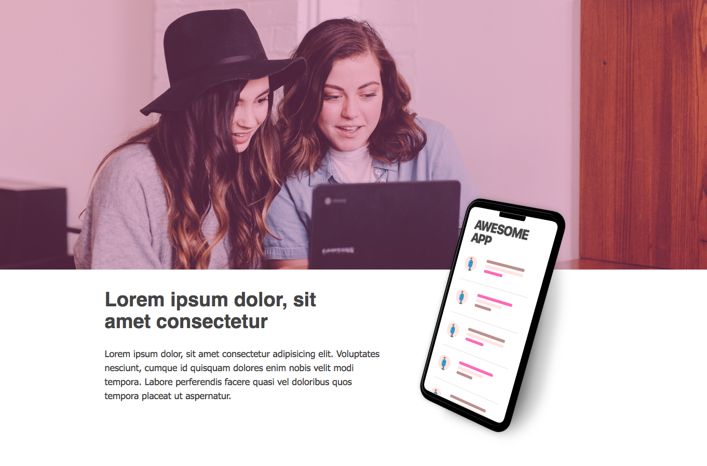
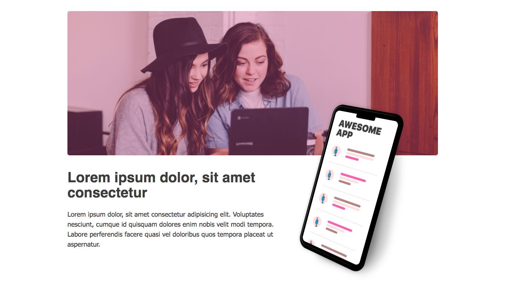
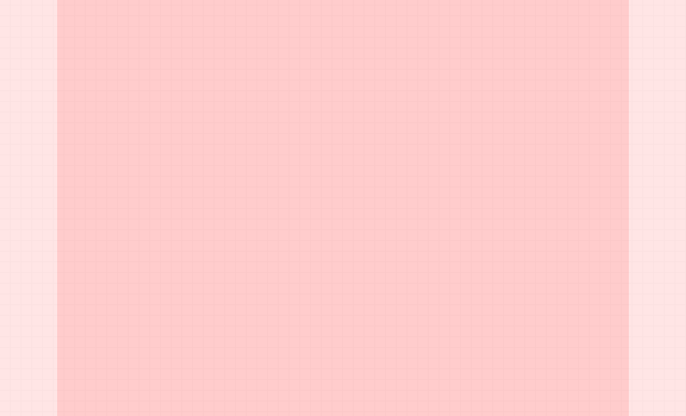
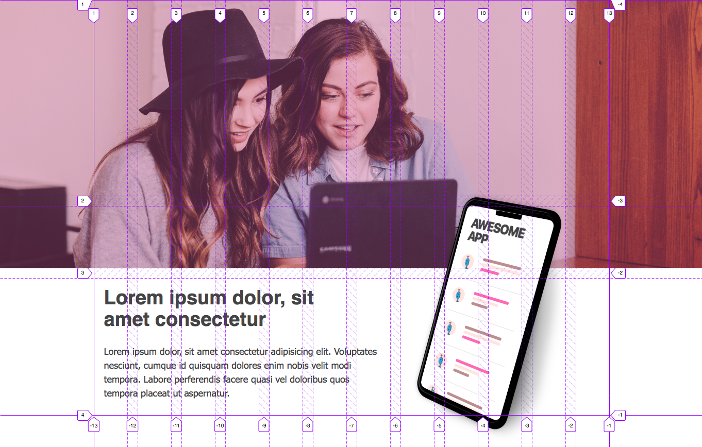
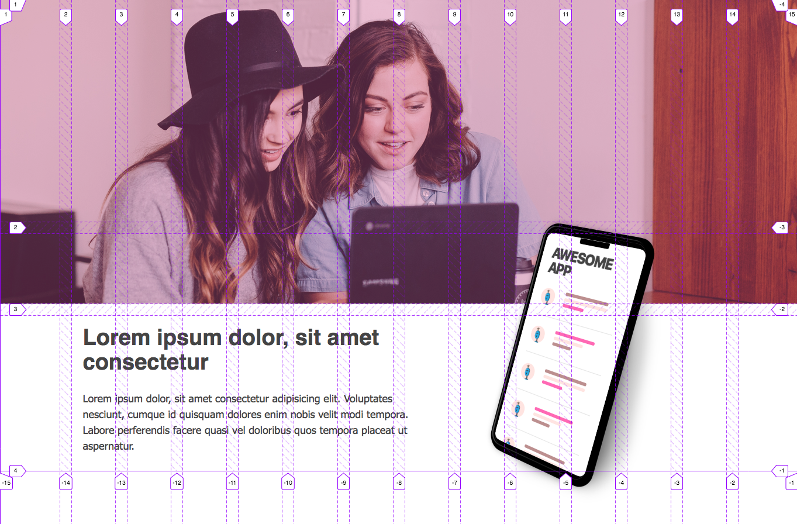

# Modern layouts with CSS Grid: Overlapping content

Let's create a hero component with CSS grid.

Our end result will be a hero UI component, that can feature a large image, with some text below and an overlapping image. There will be two varations - one with the large image spanning edge to edge and one with the large image with confined width.





## Creating Grid

First things first - we will need to create a container that holds the content, centers it on screen and gives some padding on smaller screens.

A common CSS recipe to do this would be:

```css
.content-container {
    max-width: 900px;
    margin: 0 auto;
    padding: 0 20px;
}
```

This way we have a very simple but fully responsive content container.

Let's refactor this recipe to use CSS Grid instead.

### Grid option: 3 column grid

First, we will define a grid container that has 3 columns:


```css
    
    grid-template-columns: minmax(20px, 1fr) minmax(min-content, var(--content-width)) minmax(20px, 1fr);
```

The most left and the most right column will be empty most of the time. 
They are the ones creating the extra spacing around our content on larger screens. We will use these 2 columns when we need the content to span edge to edge. The main content will live in the middle column.

The first and last column will be at least 20px wide, this will give us space on mobile.

The middle column will be as wide as the content, but not expand beyond the width we have set, in this case 1120px.



Let's add the variable responsible for the size of the content:

```css
:root {
    --content-width: 1120px;
}
```

That way we have only one place to change when we need to update it - great!

We can also set a default rule to center any content that is direct child of the 3 column grid:

```css
.grid > * {
    grid-column: 2 / span 1;
}
```

Whenever we want our content to span edge to edge, we can add a special class to the HTML element:

```css
.fullscreen {
    grid-column: 1 / -1;
}
```

So far so good - we can add content with fixed width, and we can add content that stretches full screen.

### Grid option 2

Another approach we can take, is to create 14 columns, first and last will be 1fr centering the centent on screen.
And inbetween we will have 12 columns with fixed width in a absolute unit and fixed gap, also in asbolute unit like `px`.


```css
.grid {
    grid-template-columns: 1fr repeat(12, 75px) 1fr;
}
```

This approach might be confusing at first, because we would need to count the column slightl different than what is in the design file.

## Creating the hero content

### Option 1

The 3 column grid container will have 2 children. One will hold the full screen image, and the other one will hold the hero text content and phone. 

So far the 3 column grid has no defined rows and so rows will be automatically created as we add more content (implicit grid).

If we do not explicitly say on which row the two children should appear, they will be placed where there is space. Since the image is spanning from edge to edge, the next child will take the next available row.

We don't want the two to appear one below each other, but on top of each other a little.

With CSS Grid we ca achieve this easily, by placing the two items in the same row: we specify `grid-row: 1;` to both children.

So we are getting closer, but not quite. We want the content to appear right below the image and only the phone to be overlapping the hero image. We also want the text and phone to appear side by side.

We will transform the hero text content container into a grid with 12 columns and 3 rows. 

Each column will be 1 fraction of the free space, and we can add a gap of `20px`. This way we can position the text and phone right next to each other.

What we want to achieve with the rows is to push the text content down, so we can see the hero image through. The first and second row should sum up to the height of the full screen image. The last row will be set to auto, so it can grow as the content grows.

For example, if we have the hero full screen image set to 400px height, then the 1st two rows should sum to the same number, we can assign each of them to be 200px - if we are okay with two rows with equal height.

Again, to improve maintanability we can make use of CSS variables.

```css
/* General 12 column content grid, we can reuse this class with other components */
.content-grid {
    display: grid;
    grid-gap: var(--column-gap);
    grid-template-columns: repeat(12, 1fr);
}

.hero-content {
    grid-template-rows: var(--hero-image-height / 2) calc(var(--hero-image-height) / 2) auto;
}

```

We might want a different amount of overlapping, and not exactly half the hero image height.

To calculate how much overlap we want, we need to know the size of the phone, so let's add this as variable.

The overlap amount, which is the size of the second row, will be a percentage of the height of the phone.
We can save the percentage in a variable, so we can adjust it on different screen sizes as needed:

```css
:root {
    --overlap-percentage: 0.6;
}
```

This way we have one place to change when adjusting the overlap size. With value of `0.8`, 80% of the phone will be overlapping the full width image. With a value of a `0.2`, only 20% will be overlapping the full width image.

Now the final value for the grid rows will be:

```css
.hero-content {
    /* Calculate overlap size */
    --overlap: calc(var(--phone-height) * var(--overlap-percentage));

    grid-template-rows: calc(var(--hero-image-height) - var(--overlap)) var(--overlap) auto;
}
```

The first row is the total height of the image minus the overlap percentage. The second row has the size of the overlap. The last row remains as `auto`, so it can grow in height as the content grows.



Since we are using CSS custom properties, in our media queries we only need to change the value of the custom property, and the grid definition will be updated accordingly. For example, this is how we can adjust the overlap amount on larger screens:

```css
@media (min-width: 700px) {
    :root {
        --overlap-percentage: 0.3;
    }
}
```

### Option 2

With a grid with 14 columns we can create the overlap a bit easier.

the hero component will have 3 rows, like we had before

We have the image spanning all 14 columns, and taking up the 1st two rows

the hero content will span 12 columns with an offset of 1

the text content will span on 7 columns, and take up the last row

the phone will span 2 rows, and take the remaining free columns



## Conclusion

We can use grid to create container that centers content on screen

We can use 2 overlapping grids, to create the effect of overlapping content

We can use 1 grid, but 14 columns might be more difficult to think about


using css grid inspector in firefox

getting images from unsplash

phone is built with html and css only 
app ui as well


